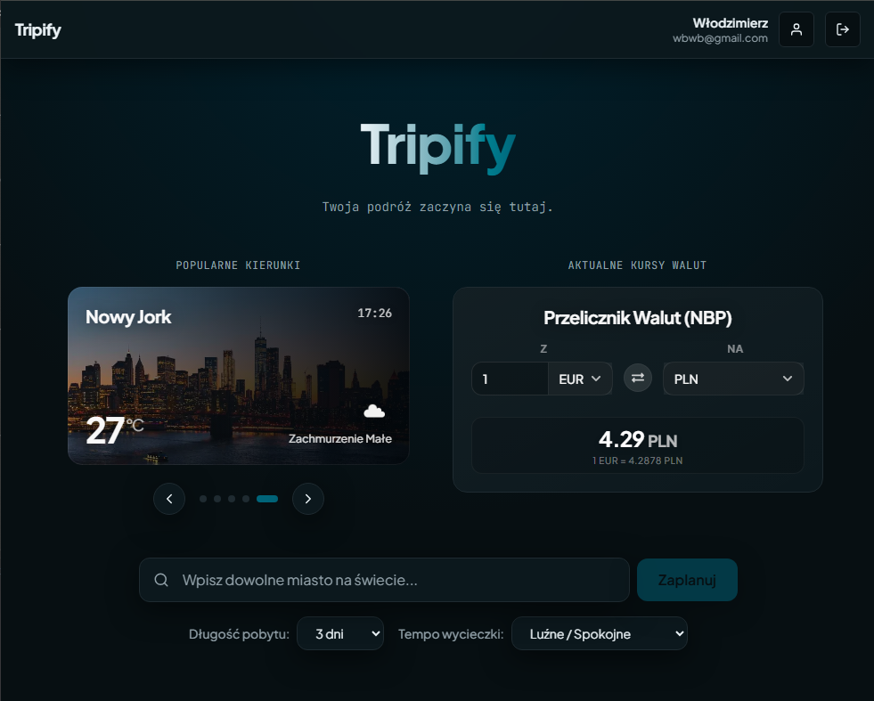
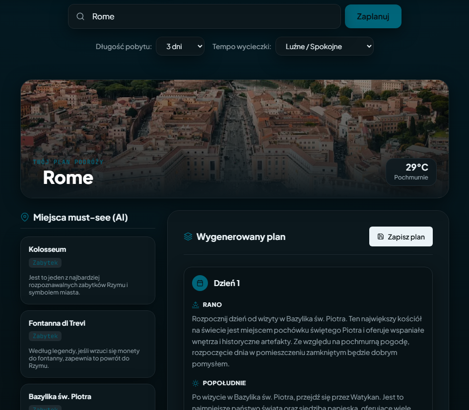

# 🌍 Tripify

<p align="center">
  
</p>

Tripify to nowoczesna aplikacja webowa do inteligentnego planowania podróży. Dzięki wykorzystaniu sztucznej inteligencji, aplikacja automatycznie generuje spersonalizowane plany wycieczek, rekomenduje miejsca warte odwiedzenia, a także dostarcza informacje o aktualnej pogodzie oraz zdjęcia z miejsc docelowych. 

<p align="center">
  
</p>

Projekt oparty jest na **architekturze mikrousług (Microservices)**, która zapewnia wysoką skalowalność, niezależność komponentów oraz wydajność.

---

## 💻 Wykorzystane technologie

Aplikacja wykorzystuje nowoczesny stos technologiczny oparty głównie na ekosystemie Javy (Spring Boot), wzbogacony o komponenty w języku Go oraz frontend w Next.js.

### 🌐 Frontend
- **Framework:** React / Next.js
- **Zarządzanie stanem i API:** Custom hooks, Fetch API
- **Style:** Vanilla CSS (autorski system designu)
- **Logowanie:** OAuth2 z PKCE Flow

### ⚙️ Backend (Architektura Mikrousług)
Rdzeń aplikacji składa się z szeregu współpracujących ze sobą mikroserwisów:

- **☕ Java 21 & Spring Boot 3.x** - główny framework backendowy.
- **🛡️ Spring Security & OAuth2** - autoryzacja i serwer uwierzytelniający (Auth Server).
- **📡 Spring Cloud Netflix Eureka** - Service Discovery (odkrywanie usług).
- **⚙️ Spring Cloud Config** - scentralizowane zarządzanie konfiguracją wszystkich usług.
- **🐹 Go (Golang)** - wysokowydajny mikroserwis do przeliczania walut z wbudowanym cache.
- **🗄️ Baza Danych:** PostgreSQL (hostowana na Google Cloud SQL).
- **🔍 ORM:** Hibernate / Spring Data JPA (z obsługą struktur Large Objects - LOB).

### 🤖 Zewnętrzne API (Integracje)
- **Groq API** - obsługa modeli sztucznej inteligencji (LLM) do generowania rekomendacji wycieczek.
- **Unsplash API** - pobieranie pięknych zdjęć dla wyszukiwanych miast.
- **OpenWeather API** - aktualne prognozy pogody dla celów podróży.
- **NBP API** - integracja z Narodowym Bankiem Polskim w module napisanym w Go, służąca do pobierania kursów walut na żywo.

### 🐳 DevOps i Infrastruktura
- **Docker & Docker Compose** - pełna konteneryzacja wszystkich usług i ujednolicenie środowiska deweloperskiego.
- **Google Cloud Platform (GCP)** - infrastruktura bazodanowa (Cloud SQL).
- **SonarQube** - statyczna analiza kodu i dbanie o czystość architektury (Clean Code).

---

## 🏗️ Struktura Mikrousług

1. **`tripify-frontend` (Port 3000)** - Interfejs użytkownika.
2. **`tripify-backend` / API Gateway (Port 8081)** - Główny serwis orkiestrujący, który odbiera zapytania od użytkownika i koordynuje zapisywanie planów do bazy.
3. **`tripify-auth-server` (Port 9000)** - Serwer uwierzytelniający dbający o bezpieczeństwo. Obsługuje logowanie, rejestrację oraz wystawianie tokenów w standardzie OAuth2.
4. **`tripify-ai-service` (Port 8082)** - Dedykowany serwis integrujący się z API Groq. Odpowiada za ciężką logikę generowania rekomendacji (must-see) z użyciem AI.
5. **`tripify-currency-converter` (Port 8083)** - Superszybki serwis napisany w **Go**. Komunikuje się z NBP, buforuje (cache) wyniki w pamięci i błyskawicznie przelicza waluty.
6. **`tripify-eureka-server` (Port 8761)** - "Książka telefoniczna" systemu. Zbiera informacje o wszystkich działających mikroserwisach, co pozwala im się ze sobą komunikować bez podawania "na sztywno" adresów IP.
7. **`tripify-config-server` (Port 8888)** - Dystrybuuje zmienne środowiskowe i pliki konfiguracyjne z dedykowanego repozytorium do wszystkich usług podczas ich uruchamiania.
8. **`tripify-sonarqube` (Port 9001)** - Narzędzie do ciągłego monitorowania jakości kodu.

---

## 🚀 Uruchomienie projektu lokalnie (Localhost)

Aby uruchomić pełne środowisko, upewnij się, że masz zainstalowanego i uruchomionego **Dockera**.

1. Upewnij się, że w głównym katalogu oraz w odpowiednich katalogach projektów znajdują się pliki `.env` ze wszystkimi wymaganymi kluczami API (Groq, Unsplash, OpenWeather) oraz adresem bazy danych GCP (`DB_IP=34.116.184.100`).

2. Zbuduj i uruchom kontenery używając Docker Compose:
   ```bash
   docker compose up -d --build
   ```

3. Usługi będą podnosić się przez dłuższą chwilę. Ze względu na zależności (Config Server musi wstać jako pierwszy, potem Eureka, potem reszta) pełne załadowanie wszystkich mikroserwisów i ich rejestracja w Eurece może potrwać około **60 sekund**.

4. Dostęp do usług:
   - 🌍 **Aplikacja (Frontend):** `http://localhost:3000`
   - 📡 **Panel Eureka:** `http://localhost:8761`
   - 📊 **SonarQube:** `http://localhost:9001`
